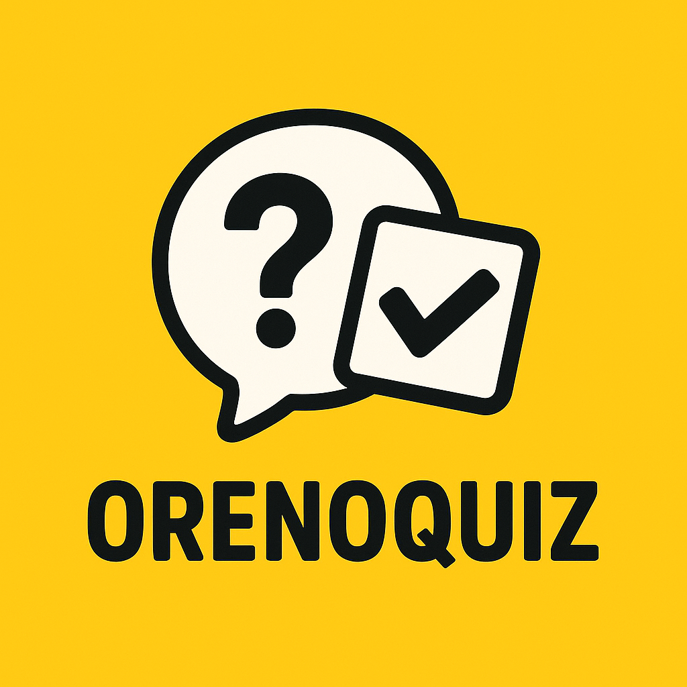

# orenoquiz



リアルタイムで遊べるクイズ & 以心伝心ゲームの統合ハブアプリ。Next.js (App Router) と neon/glass ルックの UI で、司会画面・参加者画面・会場表示をすべてブラウザだけで運営できます。

## 主な機能

- **シンプルクイズ**：早押し／並べ替えに対応。参加者端末から回答し、司会画面で進行、会場用ボードで結果を投影。
- **以心伝心ゲーム**：2 人が手書きで回答を描き、司会者が判定。参加者・ボード・結果一覧をリアルタイムで同期。

## 技術スタック

| Category      | Tech                                                                     |
| ------------- | ------------------------------------------------------------------------ |
| Framework     | Next.js 14 (App Router)                                                  |
| UI/Styling    | Tailwind CSS, custom neon/glass utility classes                          |
| Auth          | NextAuth                                                                 |
| Data Layer    | Prisma, tRPC, SQLite/PostgreSQL (任意の Prisma サポート DB)               |
| State/Queries | @tanstack/react-query via tRPC                                           |
| Misc          | DaisyUI, next-qrcode, custom SignaturePad component                      |

## セットアップ

1. **環境変数の準備**
   ```bash
   cp .env.example .env.local
   ```
   `DATABASE_URL`, `NEXTAUTH_SECRET`, OAuth プロバイダなどを設定。

2. **依存関係のインストール**
   ```bash
   corepack enable
   yarn install
   ```
   Node.js 22.x が必要です（`.nvmrc` がある場合は `nvm use`）。

3. **Prisma の準備**
   ```bash
   yarn db:push        # schema を DB に反映
   yarn postinstall    # prisma generate（インストール時にも実行されます）
   ```

4. **開発サーバーを起動**
   ```bash
   yarn dev
   ```
   `http://localhost:3000` を開きます。

## 主要スクリプト

| Command         | 説明                                           |
| --------------- | ---------------------------------------------- |
| `yarn dev`      | Next.js 開発サーバーを起動                     |
| `yarn build`    | 本番ビルド + `prisma db push`                  |
| `yarn start`    | 本番ビルドを起動                               |
| `yarn db:push`  | Prisma schema を DB に適用                     |
| `yarn format`   | Biome で `src` 以下を整形                      |

## ディレクトリ構成（抜粋）

```
src/
├─ app/
│  ├─ page.tsx                 # トップページ（ゲーム選択）
│  ├─ quiz/                    # シンプルクイズ機能 (host/board/participant 等)
│  └─ ishindenshin/            # 以心伝心ゲーム (host/board/result/answer)
├─ components/                 # 共通 UI とドメイン別コンポーネント
└─ utils/api.tsx               # tRPC hooks
public/
├─ image/                      # ロゴ・各ゲームサムネイル
└─ sound/                      # 効果音
```

## 開発 Tips

- **Neon Background**：`NeonBackground` でページ全体を包むと、グラデーションやガラス風カードが簡単に使えます。
- **SignaturePad**：`src/components/common/SignaturePad.tsx` は Canvas を直接制御しています。ポインタ調整やサイズ変更はここから。
- **TRPC ルーター**：`src/server/api/routers/` 以下に API を追加します。`utils/api.tsx` で hooks 化されています。
- **UI 一貫性**：`glass-panel` クラスや `primary-glow` を活用し、コントラストと読みやすさを維持してください。

## 貢献方法

1. Issue や Pull Request でやりたいことを共有。
2. フィーチャーブランチで作業し、`yarn format` を実行。
3. 必要に応じてスクリーンショットやテスト結果を添付。

## ライセンス

プロジェクトの利用ポリシーはリポジトリルートの LICENSE（未作成の場合は別途合意）に従います。
